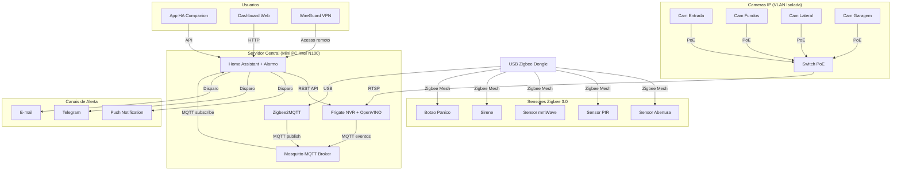
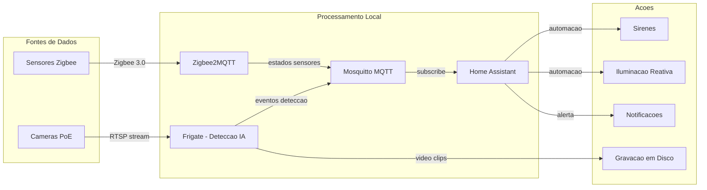
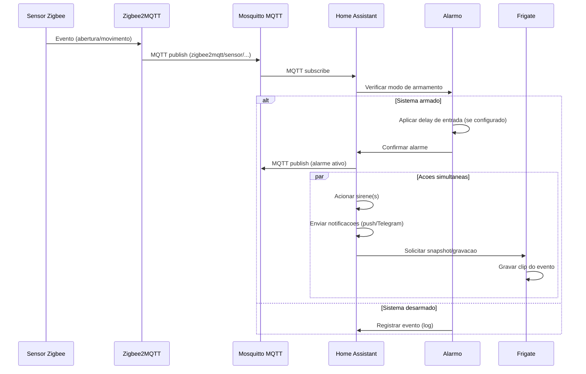
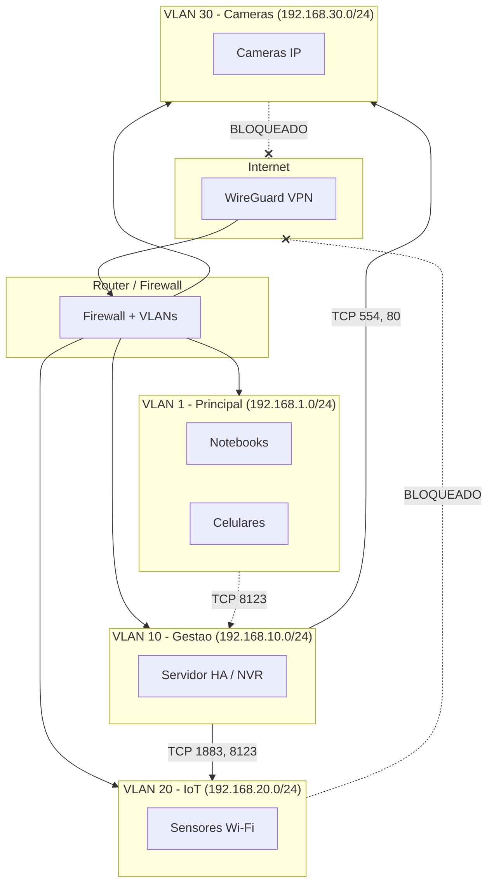

# Arquitetura do Sistema

> Sistema de Home Security – Open Source / Open Hardware
>
> Versao: 1.0 | Data: 2026-02-18

---

## 1. Visao geral

Sistema de seguranca residencial 100% local (on-premise), sem dependencia de nuvem, projetado para tres cenarios: propriedade rural, casa urbana e apartamento. Utiliza abordagem defense-in-depth com tres camadas de seguranca (passiva, ativa, reativa).

### Principios arquiteturais

- **Privacy by design**: Processamento e armazenamento 100% local
- **Modularidade**: Componentes independentes comunicando via MQTT
- **Resiliencia**: Modos de operacao degradada, failover de comunicacao
- **Interoperabilidade**: Protocolos abertos (Zigbee, MQTT, RTSP, ONVIF)

---

## 2. Diagrama de componentes

---

## 3. Fluxo de dados

---

## 4. Fluxo de evento de alarme

---

## 5. Arquitetura de rede

### Regras de acesso entre VLANs

| Origem | Destino | Permitido | Portas |
|--------|---------|-----------|--------|
| VLAN 1 (Principal) | VLAN 10 (Gestao) | Sim | TCP 8123 (dashboard HA) |
| VLAN 10 (Gestao) | VLAN 20 (IoT) | Sim | TCP 1883 (MQTT), 8123 |
| VLAN 10 (Gestao) | VLAN 30 (Cameras) | Sim | TCP 554 (RTSP), 80, 443 |
| VLAN 20 (IoT) | Internet | **Nao** | - |
| VLAN 30 (Cameras) | Internet | **Nao** | - |
| VLAN 10 (Gestao) | Internet | Limitado | TCP 443 (updates), NTP |

---

## 6. Stack tecnologico

| Componente | Tecnologia | Funcao |
|------------|-----------|--------|
| **Automacao** | Home Assistant + Alarmo | Central de automacao e alarme |
| **NVR + IA** | Frigate (OpenVINO) | Gravacao + deteccao de objetos |
| **Sensores** | Zigbee 3.0 via Zigbee2MQTT | Sensores wireless |
| **Messaging** | Mosquitto (MQTT) | Comunicacao entre servicos |
| **Infra dev** | Docker Compose | Orquestracao em desenvolvimento |
| **Infra prod** | K3s (Kubernetes) | Orquestracao em producao |
| **Hardware** | Mini PC Intel N100 | Hub de processamento |
| **Cameras** | Reolink / Hikvision (PoE) | Videovigilancia |
| **Acesso remoto** | WireGuard VPN | Acesso seguro externo |
| **Coordenador** | Sonoff ZBDongle-P (CC2652P) | Bridge Zigbee-USB |

---

## 7. Ambientes de deploy

| Ambiente | Tecnologia | Diretorio | Uso |
|----------|-----------|-----------|-----|
| **Desenvolvimento** | Docker Compose | `src/docker-compose.yml` | Testes locais |
| **Staging** | K3s + Kustomize | `k8s/overlays/staging/` | Validacao pre-producao |
| **Producao** | K3s + Kustomize | `k8s/overlays/production/` | Deploy real com Ingress |

---

## 8. Decisoes de arquitetura

Decisoes formalizadas em Architecture Decision Records (ADRs):

| ADR | Decisao | Documento |
|-----|---------|-----------|
| ADR-001 | Home Assistant como plataforma principal | `docs/adr/001-adoption-home-assistant.md` |
| ADR-002 | Frigate como NVR com IA | `docs/adr/002-adoption-frigate.md` |
| ADR-003 | Zigbee 3.0 como protocolo de sensores | `docs/adr/003-adoption-zigbee.md` |
| ADR-004 | K3s como infraestrutura de produção | `docs/adr/004-adoption-kubernetes.md` |
| ADR-005 | Mini PC N100 como hardware principal | `docs/adr/005-adoption-mini-pc-n100.md` |
| ADR-006 | Câmeras PoE como padrão | `docs/adr/006-adoption-poe-cameras.md` |
| ADR-007 | Acesso remoto VPN-only | `docs/adr/007-adoption-vpn-only-remote-access.md` |
| ADR-008 | PostgreSQL com isolamento por schema | `docs/adr/008-adoption-postgres-schema-isolation.md` |
| ADR-009 | Compose para dev + K3s para produção | `docs/adr/009-adoption-compose-and-k3s.md` |
| ADR-010 | External Secrets em produção | `docs/adr/010-adoption-external-secrets.md` |

---

## 9. Modulos do sistema

| Modulo | Descricao | PRD |
|--------|-----------|-----|
| Plataforma de sensores e alarmes | Sensores Zigbee + Alarmo | PRD_SENSORS_AND_ALARMS_PLATFORM |
| Videovigilancia e NVR | Cameras + Frigate + deteccao IA | PRD_VIDEO_SURVEILLANCE_AND_NVR |
| Dashboard de monitoramento | Interface web + mobile | PRD_MONITORING_DASHBOARD |
| Seguranca de rede | VLANs + firewall + VPN | PRD_NETWORK_SECURITY |
| Drones autonomos | UGV/UAV com IA embarcada | PRD_AUTONOMOUS_DRONES |

---

## Referencias

- `docs/ARQUITETURA_TECNICA.md` — Detalhamento tecnico completo
- `docs/ARQUITETURA_SEGURANCA_FISICA.md` — Camadas de seguranca fisica
- `docs/ARQUITETURA_DRONES_AUTONOMOS.md` — Arquitetura de drones
- `docs/THREAT_MODEL.md` — Modelo de ameacas (STRIDE)
- `rules/RULES_COMPLIANCE_AND_STANDARDS.md` — Normas e compliance
