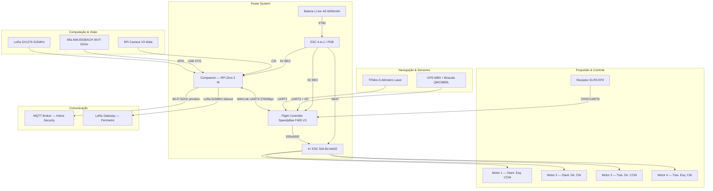

# Arquitetura de Hardware — Drone Aéreo (UAV)

**Data**: 2026-02-22
**Revisão**: v2.0 (T-032 — critérios de aceite completos)
**Responsável**: Agente_Arquiteto_Drones

---

## 1. Visão Geral

O UAV (Unmanned Aerial Vehicle) do projeto Home Security DIY é um **quadricóptero autônomo de patrulha long-range** capaz de decolar por alarme, inspecionar o perímetro e transmitir vídeo em tempo real ao dashboard. O projeto prioriza eficiência de voo (>20 min) e integração MQTT com Home Assistant via MAVLink bridge.

**Desafio principal**: Autonomia vs. Peso. O hardware deve ser leve o suficiente para volar por 20+ minutos, mas robusto para carregar o computador de missão (RPi Zero 2 W) e câmera.

**Decisão de plataforma**:
- **MVP (Fase 1)**: Frame 7", PX4 + Raspberry Pi Zero 2 W, comunicação Wi-Fi primária
- **v2.0 (Fase 2)**: Companion NVIDIA Jetson Orin Nano para IA embarcada

> **Regulamentação**: UAV com peso total >250 g exige registro SISANT (ANAC) antes de qualquer voo outdoor. Operação de segurança patrimonial = não-recreativa → RETA obrigatório. Ver `standards/STANDARDS_TO_RESEARCH.md` §5.

---

## 2. Diagrama de Blocos



---

## 3. Especificações de Hardware

### 3.1 Frame e Propulsão

| Componente | Especificação Definida | Justificativa |
|-----------|------------------------|---------------|
| **Frame** | Mark4 7-inch Carbon Fiber | Leve (120 g), robusto, amplo mercado de peças |
| **Motores** | EMAX ECO II 2807 1300KV (4×) | Eficiência em 6S, torque para hélices 7" |
| **Hélices** | HQProp 7×4×3 Tri-blade | Boa tração, vibração reduzida |
| **ESC** | SpeedyBee F405 V3 Stack 4-in-1 50A | BLHeli32 + telemetria, integrado com FC |

### 3.2 Flight Controller (FC)

**Decisão**: **SpeedyBee F405 V3** (firmware PX4)

| Alternativa | Decisão | Motivo |
|------------|---------|--------|
| SpeedyBee F405 V3 | ✅ **Selecionado** | Custo-benefício (R$ 350), 4 UARTs livres, BEC integrado 5V/3A |
| Pixhawk 6C | Fase 2 | Excelente, mas R$ 1.200+; overkill para MVP |
| Holybro Kakute H7 | Alternativa | Muito similar ao SpeedyBee, mesma faixa de preço |

**Firmware**: **PX4 Autopilot** (compatibilidade nativa com MAVROS/ROS2, MAVLink v2, Offboard mode)

### 3.3 Computador de Bordo (Companion)

**Decisão MVP**: **Raspberry Pi Zero 2 W**

| Alternativa | Decisão | Motivo |
|------------|---------|--------|
| **RPi Zero 2 W** | ✅ **MVP** | Leve (13 g), baixo consumo (1W idle), suficiente para bridge MAVLink + MQTT |
| RPi 4 (4 GB) | Fase 1.5 | Caso visão computacional leve seja necessária sem Jetson |
| NVIDIA Jetson Orin Nano | Fase 2 | IA embarcada (YOLO); desnecessário para bridge pura |

**Função no MVP**: Ponte MAVLink ↔ MQTT. Lê telemetria do FC via UART (MAVLink v2, 57600 bps) e publica em `uav/status` e `uav/location`. Recebe comandos de `uav/command` e repassa ao FC.

**Conexão ao FC**: `MAVLINK_CONNECTION=serial:/dev/serial0:57600` (variável de ambiente em `src/drones/uav/mavlink_bridge.py`)

### 3.4 Câmera Embarcada

**Decisão**: **Raspberry Pi Camera Module V3 Wide**

| Especificação | Valor |
|--------------|-------|
| Sensor | Sony IMX708 (12 MP) |
| Ângulo de visão | 120° diagonal (wide) |
| Interface | CSI (15-pin FFC) |
| Resolução máxima vídeo | 1080p60 / 4K30 |
| HDR | Sim (nativo) |
| Visão noturna | Não (adicionar IR cut filter ou câmera NoIR para uso noturno) |
| Peso | ~4 g |

### 3.5 Sensores de Navegação

| Sensor | Modelo | Interface | Função |
|--------|--------|-----------|--------|
| **GPS + Bússola** | Beitian BN-880 (M8N + QMC5883L) | UART3 + I2C | Posição GPS global + heading |
| **Altímetro Laser** | TFMini-S | UART2 | Altitude precisa 0–12 m (pouso e patrulha baixa) |
| **IMU** | Embutida no FC (MPU6000 / ICM-20689) | SPI (interno) | Estabilização de voo |

### 3.6 Comunicação — Wi-Fi Primário + LoRa Failover

**Arquitetura de comunicação em 3 camadas** (igual ao UGV):

| Prioridade | Canal | Módulo | Alcance | Protocolo | Latência |
|-----------|-------|--------|---------|-----------|---------|
| 1 (primário) | **Wi-Fi 5 GHz** | Alfa AWUS036ACH (AC1200, USB) | 200–500 m LoS | MQTT sobre TCP | <50 ms |
| 2 (failover) | **LoRa 915 MHz** | Módulo SX1276 / RFM95W (SPI) | 2–15 km | LoRa raw / Meshtastic | 300–1500 ms |
| 3 (controle manual) | **RC 2.4 GHz** | ExpressLRS EP2 | 500 m–2 km | CRSF | <5 ms |

**Lógica de failover** (implementada no `mavlink_bridge.py` — Fase 1.5):
```
if mqtt_ping > 3s:
    → publicar via LoRa (telemetria crítica apenas: GPS, bateria, modo)
    → aguardar reconexão Wi-Fi
if mqtt_ping > 30s:
    → ativar modo autônomo (RTL — Return to Launch)
```

**Parâmetros do módulo LoRa (SX1276)**:
- Frequência: 915 MHz (Banda H — livre no Brasil por Resolução ANATEL nº 506/2008)
- Spreading Factor: SF10 (equilíbrio alcance/velocidade)
- Bandwidth: 125 kHz
- Potência TX: 17 dBm (~50 mW — abaixo do limite de 400 mW da ANATEL)

### 3.7 Bateria e Autonomia

**Bateria definida**: Li-Ion 4S2P 6000 mAh (pack customizado com células Sony VTC6 ou Molicel P42A)

**Cálculo de autonomia**:

| Parâmetro | Valor |
|-----------|-------|
| Tensão nominal 4S | 14,8 V |
| Capacidade | 6.000 mAh = 6 Ah |
| Energia total | 14,8 × 6 = **88,8 Wh** |
| Corrente hover estimada (4× motores) | ~15 A a 14,8 V = 222 W |
| Corrente eletrônica (FC + RPi + Wi-Fi) | ~1,5 A = 22 W |
| Consumo total hover | ~244 W |
| **Autonomia teórica hover** | 88,8 Wh ÷ 244 W × 60 = **~21 min** |
| Autonomia operacional (80% usável) | **~17 min** |
| Autonomia em patrulha (mix hover+translação) | **20–25 min** |

> **Vantagem Li-Ion vs. LiPo**: Maior densidade energética (260 Wh/kg vs. 200 Wh/kg), vida útil 3× maior (500 ciclos vs. 150 ciclos). Desvantagem: descarga de pico limitada (não serve para acrobacia).

---

## 4. Bill of Materials (BOM) Completa — MVP

### 4.1 Componentes e Fornecedores

| Componente | Modelo | Fornecedor Nacional | Custo Est. (BRL) |
|-----------|--------|---------------------|------------------|
| Frame 7" Carbon | Mark4 7-inch ou similar | [Robocore](https://www.robocore.net/) / [AliExpress](https://pt.aliexpress.com/) | R$ 250–400 |
| FC + ESC Stack | SpeedyBee F405 V3 (50A 4-in-1) | [Robocore](https://www.robocore.net/) / [Mercado Livre](https://www.mercadolivre.com.br/) | R$ 350–500 |
| Motores (×4) | EMAX ECO II 2807 1300KV | [Robocore](https://www.robocore.net/) / [Mercado Livre](https://www.mercadolivre.com.br/) | R$ 400–600 |
| Hélices 7×4×3 (×4+spares) | HQProp 7×4×3 Tri-blade | [Mercado Livre](https://www.mercadolivre.com.br/) / AliExpress | R$ 50–80 |
| GPS + Bússola | Beitian BN-880 (M8N) | [FilipeFlop](https://www.filipeflop.com/) / [Mercado Livre](https://www.mercadolivre.com.br/) | R$ 100–150 |
| Altímetro Laser | TFMini-S (UART) | [Mercado Livre](https://www.mercadolivre.com.br/) / AliExpress | R$ 80–120 |
| Receptor RC | ExpressLRS EP2 (2,4 GHz) | [Mercado Livre](https://www.mercadolivre.com.br/) / AliExpress | R$ 80–150 |
| Companion Computer | Raspberry Pi Zero 2 W | [FilipeFlop](https://www.filipeflop.com/) / [Robocore](https://www.robocore.net/) | R$ 150–250 |
| Câmera | RPi Camera Module V3 Wide | [FilipeFlop](https://www.filipeflop.com/) / [Robocore](https://www.robocore.net/) | R$ 180–250 |
| Wi-Fi USB | Alfa AWUS036ACH (AC1200) | [Mercado Livre](https://www.mercadolivre.com.br/) | R$ 150–200 |
| LoRa Module | SX1276 / RFM95W 915MHz | [FilipeFlop](https://www.filipeflop.com/) / [Mercado Livre](https://www.mercadolivre.com.br/) | R$ 40–80 |
| Bateria | Li-Ion 4S2P 6000mAh (custom ou LiPo 4S 5000mAh pronta) | [Mercado Livre](https://www.mercadolivre.com.br/) | R$ 300–500 |
| Conector XT60 + BEC auxiliar | — | [FilipeFlop](https://www.filipeflop.com/) | R$ 25–50 |
| Capacitor bulk 1000μF 35V | — | Lojas eletrônica local | R$ 5–10 |
| **TOTAL ESTIMADO** | | | **R$ 1.960 – 3.340** |

### 4.2 Ferramentas necessárias para montagem

| Ferramenta | Finalidade |
|-----------|-----------|
| Ferro de solda 60W + estanho | Soldar ESC, conectores, capacitor |
| Chaves Allen M2/M2.5/M3 | Fixação de motores e frame |
| Multímetro | Verificar tensões e continuidade |
| Trava-rosca Loctite 243 (azul) | Fixação de parafusos de motor |
| Abraçadeiras de nylon (×20) | Organização de cabos |
| Fita dupla-face de espuma 3M | Fixação antivibração do FC e RPi |
| Balanceador de hélices | Reduzir vibração mecânica |

---

## 5. Integração com o Código

### Variáveis de ambiente para hardware real

Ao conectar hardware físico, substituir no `.env`:

```bash
# Conexão MAVLink real via UART (RPi Zero → FC)
MAVLINK_CONNECTION=serial:/dev/serial0:57600

# OU via UDP se usando roteador intermediário
# MAVLINK_CONNECTION=udpin:0.0.0.0:14550
```

### Habilitação de pymavlink (Fase 1.5 — T-033)

O arquivo `src/drones/uav/mavlink_bridge.py` atualmente usa simulação física (mock). A integração com MAVLink real é responsabilidade de **T-033 (firmware de controle)**. O parâmetro `MAVLINK_CONNECTION` já está mapeado — apenas descomentar `pymavlink` em `requirements.txt` quando T-033 for iniciado.

### Tópicos MQTT publicados pelo UAV

| Tópico | Frequência | Conteúdo |
|--------|-----------|---------|
| `uav/status` | 1 Hz | `{armed, mode, battery, heading, timestamp}` |
| `uav/location` | 1 Hz | `{latitude, longitude, altitude, gps_accuracy}` |
| `uav/command` | Assinado | Comandos recebidos: `arm`, `disarm`, `takeoff`, `land` |

---

## 6. Critérios de Aceite — Status

- [x] BOM completa com fornecedores e custos (§4.1)
- [x] Especificação do frame (§3.1 — Mark4 7", Carbon, 120 g)
- [x] Especificação do flight controller (§3.2 — SpeedyBee F405 V3 / PX4)
- [x] Especificação dos motores e ESCs (§3.1 — EMAX 2807 1300KV + 50A BLHeli32)
- [x] Especificação da câmera embarcada (§3.4 — RPi Camera V3 Wide, Sony IMX708)
- [x] Especificação de comunicação Wi-Fi + LoRa failover (§3.6)
- [x] Estimativa de autonomia de voo (§3.7 — ~20–25 min em patrulha)
- [x] Estimativa de custo total (§4.1 — R$ 1.960–3.340)
