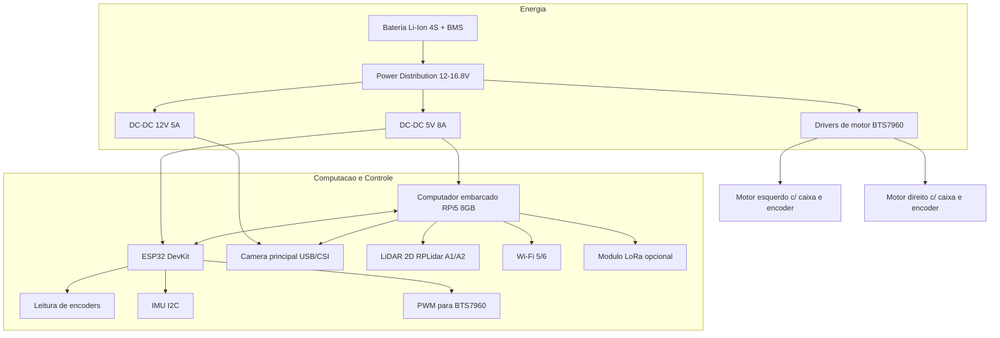

# Arquitetura de Hardware - Drone Terrestre (UGV)

Data: 2026-02-22
Referencia: Tarefa T-031 (TASKS_BACKLOG) e Issue #86

---

## 1. Visao Geral

Este documento define a arquitetura de hardware para o UGV (Unmanned Ground Vehicle)
do projeto Home Security DIY, com foco em patrulha de perimetro residencial, deteccao
visual e navegacao autonoma assistida por ROS2/Nav2.

Objetivos de engenharia:
- operacao outdoor (quintal/jardim/corredor lateral),
- modularidade para manutencao e upgrade,
- custo controlado para MVP,
- compatibilidade com stack ROS2 prevista no projeto (T-034).

---

## 2. Requisitos Funcionais de Hardware (MVP)

- Locomocao diferencial (2WD com caster ou 4WD skid-steer).
- Navegacao local com odometria + IMU + LiDAR 2D.
- Visao frontal para deteccao de intrusos e teleoperacao.
- Telemetria e comandos via MQTT atraves do computador embarcado.
- Autonomia alvo: 45 a 90 minutos por carga (perfil patrulha intermitente).

---

## 3. Diagrama de Blocos

---

## 4. Especificacao Tecnica por Subsistema

### 4.1 Chassis

- Tipo: skid-steer 4WD (recomendado para outdoor) ou 2WD + caster (versao economica).
- Material: aluminio 2 mm + suportes impressos em PETG/ABS.
- Dimensoes alvo: 420 x 320 x 220 mm (C x L x A).
- Carga util minima: 4 kg (SBC, bateria, sensores e margem para expansao).
- Protecao ambiental: minimo IP54 para caixa eletrica e conectores externos.
- Terreno alvo: piso irregular leve, grama baixa, brita fina e concreto.

### 4.2 Motores e Tracao

- Arquitetura: 2 canais de tracao (esquerda/direita) com controle diferencial.
- Tipo: motor DC com caixa planetaria 12V ou 24V com encoder Hall.
- Especificacao minima por canal:
  - torque continuo >= 1.5 N.m,
  - corrente nominal 3-6 A,
  - pico suportado >= 15 A,
  - encoder incremental >= 11 PPR (com multiplicacao por gearbox).
- Velocidade alvo de patrulha: 0.4 a 1.2 m/s.

### 4.3 Controlador de Baixo Nivel (MCU)

- Componente: ESP32 DevKit V1 (WROOM, dual-core).
- Responsabilidades:
  - controle PWM dos motores,
  - leitura de encoder e IMU,
  - watchdog de seguranca,
  - fail-safe (parada em perda de heartbeat do SBC).
- Interface com SBC: serial USB (MVP) com protocolo de comandos/telemetria.

### 4.4 Computador Embarcado (SBC)

- Recomendado: Raspberry Pi 5 (8GB).
- Alternativas:
  - Raspberry Pi 4 (4GB/8GB) para MVP de custo menor,
  - Jetson Orin Nano para cenarios de IA embarcada pesada.
- Responsabilidades:
  - ROS2 Humble,
  - Nav2/SLAM,
  - pipeline de visao,
  - bridge MQTT com Home Assistant.

### 4.5 Sensores

- LiDAR 2D: RPLidar A1/A2 (driver ROS2 disponivel).
- Camera principal: CSI wide-angle ou USB UVC 1080p/30fps.
- IMU: BNO055 (preferencial) ou MPU6050 (economica).
- Odometria: encoders Hall nos eixos dos motores.
- Sensor de bateria: divisor resistivo + ADC no ESP32.
- Ultrassonico frontal (opcional de seguranca): HC-SR04 industrializado.

### 4.6 Energia

- Bateria: Li-Ion 4S (14.8V nominal), 8 Ah a 12 Ah.
- BMS: 4S com balanceamento e protecao de sobrecorrente/sobretensao.
- Conversao:
  - 5V/8A dedicado ao SBC,
  - 5V/2A para perifericos,
  - trilho direto para drivers de motor.
- Protecoes obrigatorias:
  - fusivel principal,
  - chave geral de corte,
  - E-stop fisico acessivel.

### 4.7 Drivers de Motor

- Modelo: BTS7960 (43A) por canal.
- Motivo: melhor margem termica e corrente que L298N.
- Nao recomendado: L298N para este caso (queda de tensao e aquecimento elevado).

---

## 5. BOM (Bill of Materials) - MVP

Valores estimados em BRL (fevereiro/2026), variando por importacao/cambio.

| Item | Especificacao | Qtd | Faixa (R$) | Fornecedores sugeridos |
|---|---|---:|---:|---|
| Chassis base | Plataforma 4WD metalica (ou custom aluminio) | 1 | 350-900 | RoboCore, FilipeFlop, Mercado Livre |
| Motor DC com encoder | 12V, caixa planetaria, alto torque | 2-4 | 300-1.000 | RoboCore, UsinaInfo, AliExpress |
| Driver de motor | BTS7960 43A | 2 | 80-180 | FilipeFlop, Mercado Livre |
| Computador embarcado | Raspberry Pi 5 8GB | 1 | 650-1.100 | FilipeFlop, KaBuM, Mercado Livre |
| MCU | ESP32 DevKit V1 | 1 | 35-70 | FilipeFlop, UsinaInfo |
| LiDAR 2D | RPLidar A1/A2 | 1 | 700-1.800 | Slamtec reseller, AliExpress |
| Camera | CSI wide-angle ou USB UVC | 1 | 180-450 | Raspberry Store, Mercado Livre |
| IMU | BNO055 (ou MPU6050) | 1 | 40-260 | FilipeFlop, UsinaInfo |
| Bateria | Li-Ion 4S 8-12Ah com BMS | 1 | 350-900 | Montagem local especializada |
| Conversores DC-DC | Buck 5V 8A + acessorios | 2 | 80-220 | Mercado Livre, UsinaInfo |
| Estrutura eletrica | fusivel, chave geral, conectores, cabos | 1 kit | 120-300 | Eletronica local |
| Caixa eletrica IP54 | policarbonato/ABS | 1 | 90-250 | Leroy/Mercado Livre |

### 5.1 Custo Total por Unidade (MVP)

- Configuracao minima funcional: R$ 3.000 a R$ 4.500
- Configuracao recomendada (robusta): R$ 4.800 a R$ 7.200
- Configuracao expandida (IA pesada): R$ 7.500 a R$ 11.000

---

## 6. Compatibilidade com ROS2/Nav2 (Aceite Tecnico)

Compatibilidade alvo: ROS2 Humble + Nav2 em Linux arm64.

Itens de compatibilidade confirmados por arquitetura:
- LiDAR 2D com driver ROS (`sensor_msgs/LaserScan`) para SLAM/Nav2.
- Odometria por encoder + IMU para estimativa de pose (`odom -> base_link`).
- Controle de base diferencial com interface `cmd_vel`.
- SBC com recursos suficientes para Nav2 + telemetria + camera (RPi5 recomendado).

Topicos/frames previstos para integracao (MVP):
- `/cmd_vel` (geometry_msgs/Twist)
- `/odom` (nav_msgs/Odometry)
- `/scan` (sensor_msgs/LaserScan)
- `/imu/data` (sensor_msgs/Imu)
- `map -> odom -> base_link` (TF tree)

Riscos tecnicos conhecidos:
- latencia de controle em serial USB mal configurada,
- ruido de encoder em baixa velocidade,
- queda de tensao em picos de motor sem margem no DC-DC.

Mitigacoes:
- watchdog e heartbeat entre SBC e MCU,
- filtragem de odometria (EKF),
- margem de corrente >= 30% no sistema de energia.

---

## 7. Checklist de Aceite da Issue #86

- [x] BOM completa com fornecedores e custos estimados.
- [x] Especificacao do chassis (indoor/outdoor, carga, IP rating).
- [x] Especificacao dos motores (tipo, torque, encoder).
- [x] Especificacao do microcontrolador/computador embarcado.
- [x] Especificacao dos sensores (LiDAR, camera, IMU, odometria).
- [x] Diagrama de blocos da arquitetura de hardware.
- [x] Estimativa de custo total por unidade.
- [x] Compatibilidade com ROS2 Nav2 documentada.

---

## 8. Proximos Passos

1. T-033: implementar firmware de controle de base diferencial no ESP32.
2. T-034: subir stack ROS2/Nav2 no SBC com bringup de sensores.
3. T-044: gerar guia de montagem UGV com esquema eletrico e pinagem final.
