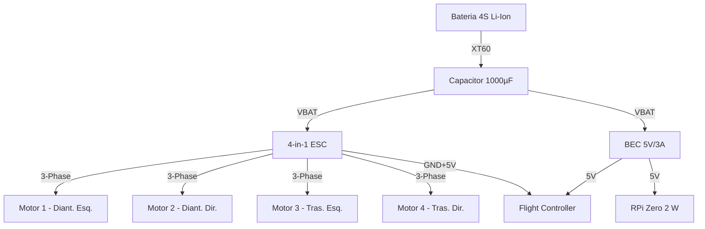

# Guia de Montagem e Wiring do UAV

Data: 2026-02-22
Referência: **Tarefa T-045**

Este guia detalha a montagem física e elétrica do Drone Aéreo Autônomo (UAV), complementando a [Arquitetura de Hardware](docs/ARQUITETURA_HARDWARE_UAV.md).

---

## 1. Lista de Materiais (BOM) — Versão MVP Long Range

### Eletrônica de Voo

| Item | Quantidade | Modelo Recomendado | Custo Est. (BRL) | Função |
|------|------------|-------------------|------------------|--------|
| **Frame** | 1 | Mark4 7-inch Carbon Fiber | R$ 250–400 | Estrutura principal |
| **Stack FC+ESC** | 1 | SpeedyBee F405 V3 (4-in-1 50A) | R$ 350–500 | Controlador de voo + ESC |
| **Motores** | 4 | EMAX ECO II 2807 1300KV | R$ 400–600 | Propulsão (6S) |
| **Hélices** | 4+4 (spare) | HQProp 7×4×3 Tri-blade | R$ 50–80 | Sustentação |
| **Receptor RC** | 1 | ExpressLRS EP1/EP2 (2,4 GHz) | R$ 80–150 | Rádio controle |
| **GPS + Bússola** | 1 | Beitian BN-880 (M8N) | R$ 100–150 | Navegação GNSS |
| **Altímetro Laser** | 1 | TFMini-S (UART) | R$ 80–120 | Altitude precisa ≤12 m |

### Computação e Visão

| Item | Quantidade | Modelo Recomendado | Custo Est. (BRL) | Função |
|------|------------|-------------------|------------------|--------|
| **Companion Computer** | 1 | Raspberry Pi Zero 2 W | R$ 150–250 | Bridge MAVLink / telemetria |
| **Câmera** | 1 | RPi Camera V3 Wide (CSI) | R$ 180–250 | Visão computacional |
| **Dongle Wi-Fi** | 1 | Alfa AWUS036ACH (USB) | R$ 150–200 | Comunicação com broker MQTT |

### Alimentação

| Item | Quantidade | Modelo Recomendado | Custo Est. (BRL) | Função |
|------|------------|-------------------|------------------|--------|
| **Bateria** | 1 | Li-Ion 4S2P 6000mAh (DIY) | R$ 300–500 | Fonte principal (≥20 min voo) |
| **BEC 5V/3A** | 1 | Embutido no FC ou MATEK PDB | R$ 0–80 | Alimentar FC + Companion |
| **Conector XT60** | 2 | XT60 Macho + Fêmea | R$ 15–25 | Conector de bateria |
| **Capacitor** | 1 | 1000–2200μF 35V (bulk cap) | R$ 10–20 | Filtro de ruído nos ESCs |

**TOTAL ESTIMADO: R$ 1.915 – 3.325**

---

## 2. Diagrama de Ligação (Wiring)

### 2.1 Distribuição de Energia



### 2.2 Conexões do Flight Controller (FC)

**Nota**: A numeração de pinos varia por modelo. Consulte o diagrama de pinout do SpeedyBee F405 V3.

| Periférico | Pino FC | Interface | Notas |
|-----------|---------|-----------|-------|
| **ESC Telemetry** | UART1 TX | UART | Telemetria de corrente/RPM (BLHeli ESC) |
| **GPS BN-880** | UART3 TX/RX | UART | Baud: 9600; Protocolo: NMEA ou UBX |
| **GPS Bússola** | I2C SDA/SCL | I2C | Endereço: 0x0D (padrão QMC5883L) |
| **Receptor RC** | UART6 RX | UART | Protocolo CRSF (ExpressLRS) |
| **TFMini-S** | UART2 TX/RX | UART | Baud: 115200; Rangefinder |
| **Companion RPi** | UART4 TX/RX | UART | MAVLink; Baud: 57600 ou 115200 |
| **Buzzer** | BUZZ+ | PWM | Bipe de arme/desarme e alertas |

### 2.3 Conexões do Companion (Raspberry Pi Zero 2 W)

| Periférico | Pino RPi | Interface | Notas |
|-----------|----------|-----------|-------|
| **FC (MAVLink)** | GPIO14 TX / GPIO15 RX | UART0 | Habilitar `serial_enable=1` no raspi-config |
| **Câmera RPi V3** | CSI (15-pin FFC) | CSI | Usar cabo FFC 15cm flat |
| **Wi-Fi Dongle** | USB OTG | USB | Via cabo micro-USB OTG adapter |

---

## 3. Configuração do Frame e Propulsão

### Spindle de Motores (ordem obrigatória para ArduPilot/PX4)

```
        FRENTE
    M1 (CCW) ─── M2 (CW)
        │           │
        │   Frame   │
        │           │
    M4 (CW)  ─── M3 (CCW)
        TRÁS
```

> **Atenção**: CCW = Contra-horário, CW = Horário visto de cima.
> Erro no sentido de rotação causa perda de controle imediata.

### Verificação de hélices

| Motor | Sentido | Hélice |
|-------|---------|--------|
| M1 (Diant. Esq.) | CCW | Topo normal (sem marcação "R") |
| M2 (Diant. Dir.) | CW | Topo reverso (marcado "R") |
| M3 (Tras. Dir.) | CCW | Topo normal |
| M4 (Tras. Esq.) | CW | Topo reverso (marcado "R") |

---

## 4. Instruções de Montagem

### Passo 1: Preparar o Frame

1. Monte os braços no centro do frame com parafusos M3 + trava-rosca (Loctite 243 azul).
2. Passe os fios dos motores pelos braços **antes** de fixar os motores.
3. Verifique se o frame está nivelado — use régua ou app de nível.

### Passo 2: Instalar Motores e ESC

1. Parafuse cada motor no extremo do braço (4× M3 por motor).
2. Conecte os 3 fios de fase do motor ao ESC 4-in-1.
   - Sentido de rotação: inverta qualquer 2 dos 3 fios para inverter o sentido.
3. Solde o capacitor bulk (1000–2200 μF, respeitando polaridade) diretamente nos pads de bateria do ESC.
4. Monte o ESC 4-in-1 na plataforma central com espaçadores de 30 mm.

### Passo 3: Flight Controller

1. Monte o FC sobre o ESC com espaçadores antivibração (borracha).
2. Conecte o conector ESC→FC (sinal + GND de cada motor).
3. **Alinhamento**: a seta de heading do FC deve apontar para a frente do drone.
   - Se montado rotacionado, configure `AHRS_ORIENTATION` no parâmetro do FC.

### Passo 4: GPS e Bússola

1. Monte o GPS no topo de um mast (poste de 50–80 mm) na parte traseira.
   - Distância mínima da eletrônica: 10 cm para evitar interferência magnética.
2. Conecte UART (GPS) e I2C (bússola) ao FC.
3. Fixe o cabo GPS com abraçadeiras para evitar vibração.

### Passo 5: Companion Computer (RPi Zero 2 W)

1. Monte o RPi em suporte de 30×65 mm impresso em 3D ou com fita dupla-face de espuma.
2. Conecte UART do FC ao UART0 do RPi (cruzado: TX→RX, RX→TX).
3. Conecte a câmera CSI com cabo flat FFC 15 cm.
4. Conecte o dongle Wi-Fi via cabo micro-USB OTG.

### Passo 6: Bateria e Cabos de Potência

1. Solde conector XT60 fêmea no cabo de bateria com fios silicone 12–14 AWG.
2. Posicione a bateria centralizada no CG do frame (use velcro dupla-face + strap).
3. Calcule o CG: deve estar a ≤5 mm do centro geométrico do frame.

### Passo 7: Rádio Controle (ExpressLRS)

1. Fixe o receptor ELRS próximo ao FC com fita dupla-face.
2. Posicione as antenas a 90° entre si para máxima cobertura.
3. Conecte ao UART do FC via protocolo CRSF.

### Passo 8: Primeiro Teste (Sem Hélices)

1. **Remova todas as hélices.**
2. Conecte a bateria — o FC deve inicializar com bipes de confirmação.
3. Verifique no Mission Planner / QGroundControl:
   - [ ] FC detectado (COM Port)
   - [ ] IMU calibrada (Accel + Compass)
   - [ ] GPS com fix (ícone verde)
   - [ ] RPi conectado via MAVLink (heartbeat)
   - [ ] ESC armado com throttle mínimo

---

## 5. Configuração de Software (FC)

### PX4 — parâmetros essenciais

| Parâmetro | Valor | Descrição |
|-----------|-------|-----------|
| `SYS_AUTOSTART` | 4001 | Quadrotor X generic |
| `SERIAL4_BAUD` | 57 (57600) | UART para companion |
| `MAV_1_CONFIG` | TELEM/SERIAL4 | MAVLink para RPi |
| `EKF2_GPS_DELAY` | 110 ms | Compensação delay GPS M8N |
| `CBRK_SUPPLY_CHK` | 0 | Checar tensão bateria |
| `COM_RC_LOSS_T` | 1.5 s | Timeout rádio → failsafe |
| `NAV_LOITER_RAD` | 15 m | Raio de loiter em modo espera |

### Calibrações obrigatórias (nesta ordem)

1. **Acelerômetro** (6 posições) — drone estático em cada eixo
2. **Bússola** — drone girado em 360° em cada eixo (longe de metal)
3. **Rádio** — stick endpoints mínimo/máximo
4. **ESC** — calibração de throttle range (full up → full down com motor disarmado)
5. **Nível** — drone em superfície plana, calibrar horizonte

---

## 6. Troubleshooting Comum

| Sintoma | Causa Provável | Solução |
|---------|---------------|---------|
| Motor não arma após ligar | Safety switch ou pré-condições não atendidas | Verificar `ARM_SWITCH_IS_BUTTON`, altitude < 0.5m, GPS fix |
| Drone oscila no ar (roll/pitch) | PIDs fora de escala para o frame | Reduzir P em 20% e fazer autotuning |
| GPS sem fix (>5 min) | Interferência magnética ou local fechado | Aumentar altura do mast GPS, calibrar bússola |
| RPi não recebe MAVLink | UART não habilitado ou baud incorreto | `raspi-config` → Interface → Serial → Enable; verificar baud |
| ESC superaquece | Corrente nos motores acima do rated (50A) | Reduzir throttle máximo em 10%, verificar calibração de acelerômetro |
| Drone inclina para um lado | Motor com sentido errado ou hélice invertida | Verificar diagrama de spindle, reconectar 2 fases do motor problemático |
| Perda de comunicação Wi-Fi | Dongle não inicializado no RPi | Verificar `iwconfig`, instalar driver `rtl88xxau` para Alfa AC1200 |
| Vibração excessiva no log | Hélices não balanceadas ou parafusos soltos | Balancear hélices com fita, verificar parafusos com Loctite |

---

## 7. Integração com software atual (MAVLink + MQTT)

Referência de implementação: `src/drones/uav/mavlink_bridge.py`

### 7.1 Variáveis de ambiente principais

- `MAVLINK_CONNECTION` (ex.: `udpin:0.0.0.0:14550`)
- `DEFENSE_PIN_UAV`
- `COMMAND_HMAC_SECRET_UAV`
- `COMMAND_ALLOWED_SOURCES_UAV`
- `COMMAND_MAX_SKEW_SECONDS_UAV`
- `WIFI_RSSI_THRESHOLD_UAV`
- `FAILOVER_TIMEOUT_SECONDS_UAV`

### 7.2 Tópicos MQTT utilizados

- Status: `uav/status`
- Localização: `uav/location`
- Comandos: `uav/command`
- Canal redundante: `uav/lora/command`
- Métricas de link: `uav/link/metrics`
- Estado de link/failover: `uav/link/state`

### 7.3 Comandos operacionais aceitos pelo bridge

- `arm`
- `disarm`
- `takeoff`
- `land`
- `inspect_zone`
- `return_home`
- `stop`

### 7.4 Critérios mínimos de validação da integração

- [ ] Publicação periódica de `uav/status` e `uav/location`.
- [ ] Comando `return_home` muda modo para RTL no bridge.
- [ ] Comando `stop` muda modo para HOLD no bridge.
- [ ] Failover para `lora` quando RSSI ficar abaixo do limiar ou timeout de link.

---

## 8. Verificações de Segurança Pré-Voo

- [ ] Hélices fixas e sem rachaduras
- [ ] Bateria acima de 80% de carga
- [ ] Chave de segurança armada corretamente
- [ ] GPS fix com ≥8 satélites
- [ ] Home Point definido automaticamente
- [ ] Modo de failsafe configurado: RTL (Return To Launch) em perda de sinal
- [ ] Área de decolagem livre de obstáculos (≥5 m de raio)
- [ ] Bateria LiPo/Li-Ion inspecionada: sem inchaço, sem odor

---

## 9. Restrições legais operacionais (obrigatório)

- Operação deve ser mantida em **VLOS** (linha de visada visual direta do piloto/operador).
- Operação de segurança patrimonial é **não recreativa** e requer conformidade regulatória.
- UAV com peso >250g requer registro no SISANT (ANAC) e observância de regras de espaço aéreo.
- Planejar geofence e altitude operacional compatíveis com a legislação local.

> Atenção: este repositório não substitui consulta jurídica/regulatória especializada.
> Ver `docs/LEGAL_AND_ETHICS.md` e `standards/STANDARDS_TO_RESEARCH.md`.
