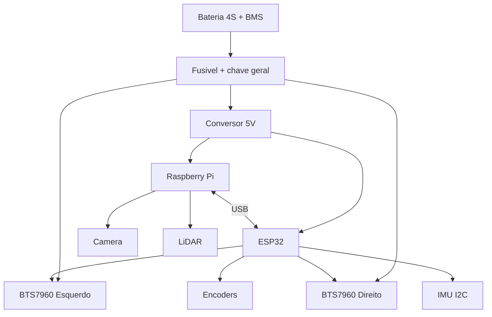

# Guia de Montagem do UGV (T-044)

Data: 2026-02-22  
Referencia: `tasks/TASKS_BACKLOG.md` (T-044)

Este guia documenta a montagem mecanica e eletrica do UGV alinhada ao firmware atual (`T-033`) e ao stack ROS2 (`T-034`).

## 1. BOM (MVP)

| Item | Qtd | Especificacao recomendada | Faixa estimada (R$) |
|------|-----|---------------------------|---------------------|
| Raspberry Pi 5 (8 GB) | 1 | Computacao de alto nivel (ROS2, visao, MQTT) | 650-1100 |
| ESP32 DevKit V1 | 1 | Controle de motores/encoders/telemetria | 35-70 |
| Driver BTS7960 | 2 | Ponte H de alta corrente (esq/dir) | 80-180 |
| Motores DC com encoder | 2 | 12V, caixa planetaria, alto torque | 300-1000 |
| Bateria Li-Ion 4S + BMS | 1 | 14.8V nominal (8-12Ah) | 350-900 |
| Step-down DC-DC | 1-2 | 5V para SBC e MCU (margem de corrente) | 80-220 |
| LiDAR 2D | 1 | RPLidar A1/A2 | 700-1800 |
| Camera frontal | 1 | CSI ou USB 1080p | 180-450 |
| IMU | 1 | BNO055 ou MPU6050 | 40-260 |
| Chassis 2WD/4WD | 1 | Estrutura metalica/aluminio | 350-900 |
| Cabos e conectores | 1 kit | XT60, fusivel, chave geral, cabos 14-18 AWG | 120-300 |

## 2. Arquitetura de montagem

## 3. Pinagem validada com firmware T-033

Arquivo de referencia: `src/drones/ugv/firmware/src/main.cpp`

### 3.1 Motores (BTS7960)

| Funcao | GPIO ESP32 |
|--------|------------|
| RPWM_L | 16 |
| LPWM_L | 17 |
| RPWM_R | 25 |
| LPWM_R | 26 |

### 3.2 Encoders

| Funcao | GPIO ESP32 |
|--------|------------|
| ENC_L_A | 34 |
| ENC_L_B | 35 |
| ENC_R_A | 32 |
| ENC_R_B | 33 |

### 3.3 Sensores e LoRa

| Funcao | GPIO ESP32 |
|--------|------------|
| BATTERY_ADC_PIN | 39 |
| LORA_SS | 5 |
| LORA_RST | 27 |
| LORA_DIO0 | 2 |
| LORA_SCK | 14 |
| LORA_MISO | 12 |
| LORA_MOSI | 13 |

### 3.4 Restricao importante

- `GPIO 18/19` devem permanecer **sem uso** neste projeto para evitar conflito historico com SPI/LoRa (issue #30).

## 4. Procedimento de montagem

1. Montar chassis e fixar motores com trava-rosca.
2. Instalar drivers BTS7960 proximos aos motores (reduz ruido em cabos de potencia).
3. Montar distribuicao de energia:
   - bateria -> fusivel -> chave geral -> drivers/DC-DC
   - garantir GND comum entre bateria, ESP32, drivers e Raspberry
4. Fixar Raspberry e ESP32 em area protegida de vibracao/umidade.
5. Conectar ESP32 aos drivers conforme pinagem validada.
6. Conectar encoders/IMU no ESP32.
7. Conectar camera e LiDAR no Raspberry.
8. Conectar USB serial entre Raspberry e ESP32.

## 5. Checklist pre-energizacao

- [ ] Polaridade da bateria verificada.
- [ ] Fusivel instalado e dimensionado.
- [ ] Chave geral funcional.
- [ ] GND comum confirmado em multimetro.
- [ ] Sem curto entre 5V e GND.
- [ ] Pinagem conforme tabela da secao 3.
- [ ] GPIO 18/19 nao conectados.
- [ ] Cabos de potencia separados de cabos de sinal/USB.

## 6. Checklist de validacao pos-montagem

### 6.1 Firmware e serial

- [ ] ESP32 reconhecido no host (`/dev/ttyUSB*`).
- [ ] Telemetria serial recebida (`O`, `B`, `W`).
- [ ] Watchdog aciona parada ao perder comando.

### 6.2 Motores e odometria

- [ ] Comando `M <left> <right>` move os lados corretos.
- [ ] `STOP` para imediatamente.
- [ ] Encoders aumentam/reduzem de forma coerente com direcao.

### 6.3 Stack ROS2/MQTT

- [ ] UGV publica status em `ugv/status`.
- [ ] Patrulha publica waypoints em `ugv/patrol/waypoints`.
- [ ] Link de comunicacao reporta `ugv/link/state`.

## 7. Troubleshooting

- Motor invertido: inverter pares de fio do motor no driver correspondente.
- Odometria invertida: revisar fase A/B do encoder.
- Reboot do Raspberry em aceleracao: aumentar margem de corrente do DC-DC e reduzir queda em cabos.
- LiDAR instavel: separar cabos USB dos cabos PWM e usar ferrite.
- ESP32 reiniciando sob carga: revisar GND comum e ripple no barramento.

## 8. Seguranca eletrica e operacional

- Nunca energizar com rodas livres sem area protegida.
- Usar E-stop fisico acessivel.
- Isolar terminais de bateria e usar conectores adequados (XT60 ou equivalente).
- Nao realizar manutencao com chave geral ligada.

## 9. Referencias cruzadas

- Arquitetura de hardware: `docs/ARQUITETURA_HARDWARE_UGV.md`
- Firmware de baixo nivel: `src/drones/ugv/firmware/src/main.cpp`
- Guia de firmware: `src/drones/ugv/firmware/README.md`
