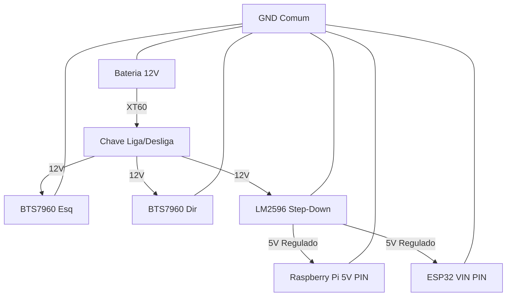

# Guia de Montagem e Wiring do UGV

Data: 2026-02-17
Referência: **Tarefa T-044**

Este guia detalha a montagem física e elétrica do Drone Terrestre Autônomo (UGV), complementando a [Arquitetura de Hardware](docs/ARQUITETURA_HARDWARE_UGV.md).

---

## 1. Lista de Materiais (BOM)

### Eletrônica Principal
| Item | Quantidade | Especificação Recomendada | Função |
|------|------------|---------------------------|--------|
| **Cérebro Alto** | 1 | Raspberry Pi 4 (4GB+) ou Pi 5 | Processamento ROS2, Visão, Wi-Fi |
| **Cérebro Baixo** | 1 | ESP32 DevKit V1 (30 pinos) | Controle de motores, odometria, sensores |
| **Driver Motor** | 2 | BTS7960 (43A) | Ponte H de alta potência para motores 12V |
| **Conversor DC-DC** | 1 | LM2596 (Step-Down) | Baixar 12V da bateria para 5V (Raspberry/ESP32) |
| **Bateria** | 1 | Li-Ion 3S (11.1V/12.6V) 5000mAh+ | Alimentação principal |

### Sensores & Periféricos
| Item | Quantidade | Especificação Recomendada | Função |
|------|------------|---------------------------|--------|
| **Câmera** | 1 | RPi Camera V3 (Wide) ou Webcam USB | Visão computacional |
| **Lidar** | 1 | RPLidar A1M8 (USB) | Navegação e mapeamento (SLAM) |
| **IMU** | 1 | MPU6050 ou BNO055 | Acelerômetro/Giroscópio (I2C) |
| **LoRa (Opcional)** | 1 | Módulo SX1276 / RFM95W | Comunicação de longa distância (backup) |

### Mecânica
| Item | Quantidade | Especificação Recomendada | Função |
|------|------------|---------------------------|--------|
| **Motores** | 2 | DC 12V Planetário c/ Encoder | Propulsão e feedback de velocidade |
| **Rodas** | 2/4 | Off-road 120mm+ | Tração |
| **Chassis** | 1 | Perfil de Alumínio 2020 ou Impressão 3D | Estrutura |
| **Roda Boba** | 1 | Caster Wheel (se usar 2 rodas motrizes) | Apoio traseiro/dianteiro |

---

## 2. Diagrama de Ligação (Wiring)

### 2.1 Alimentação (Power Distribution)

### 2.2 Conexões ESP32 (Pinout)

**Atenção**: O ESP32 opera em 3.3V, mas muitos sensores são 5V. Use divisores de tensão se necessário (para encoders 5V).

| Componente | Pino Componente | Pino ESP32 (GPIO) | Notas |
|------------|-----------------|-------------------|-------|
| **Motor Esq** | RPWM | 16 | PWM Frente |
| | LPWM | 17 | PWM Trás |
| | R_EN + L_EN | 3.3V | Habilitar Driver |
| **Motor Dir** | RPWM | 18 | PWM Frente |
| | LPWM | 19 | PWM Trás |
| | R_EN + L_EN | 3.3V | Habilitar Driver |
| **Encoder Esq** | A (Sinal) | 34 | Input Only |
| | B (Sinal) | 35 | Input Only |
| **Encoder Dir** | A (Sinal) | 32 | Input |
| | B (Sinal) | 33 | Input |
| **IMU (I2C)** | SDA | 21 | Padrão I2C |
| | SCL | 22 | Padrão I2C |
| **Raspberry Pi** | USB | USB | Serial Communication |

---

## 3. Instruções de Montagem

### Passo 1: Preparação do Chassis
1. Monte a estrutura base (alumínio ou 3D).
2. Fixe os suportes dos motores com parafusos M3/M4 e trava-rosca.

### Passo 2: Motores e Drivers
1. Instale os motores e as rodas.
2. Fixe as placas BTS7960 próximas aos motores para reduzir o comprimento dos cabos de potência.
3. Conecte os fios grossos (14-16 AWG) da Bateria -> BTS7960 -> Motor.

### Passo 3: Eletrônica Central
1. Monte o Raspberry Pi e o ESP32 em uma plataforma central elevada (protegida de poeira/água).
2. Conecte o cabo USB entre RPi e ESP32.
3. Conecte o Lidar e a Câmera às portas USB/CSI do Raspberry Pi.

### Passo 4: Primeiros Testes
1. **Sem hélice/rodas no chão**: Ligue a chave geral.
2. Verifique se o LED do ESP32 e do Raspberry Pi acendem.
3. Acesse o RPi via SSH e verifique se detecta o ESP32 (`ls /dev/ttyUSB*`).
4. Rode o script de teste de motores (cuidado com o sentido de rotação).

---

## 4. Troubleshooting Comum

- **Motor gira ao contrário**: Inverta os fios M+ e M- no born do driver BTS7960.
- **Odometria negativa indo pra frente**: Inverta os pinos A e B do encoder no código ou no fio.
- **Undervoltage no RPi**: Use fios curtos e grossos do LM2596 até o GPIO do Pi, ou use um cabo USB-C de alta qualidade cortado.
- **Interferência no Lidar**: Mantenha cabos de motor (PWM ruidoso) longe do cabo USB do Lidar. Use anéis de ferrite.
