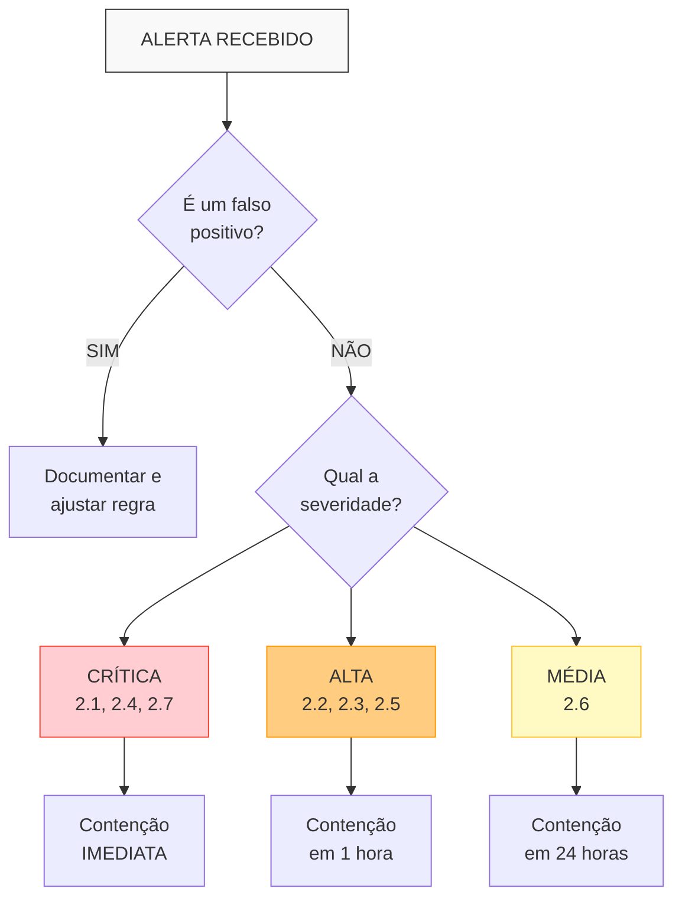

# Plano de Resposta a Incidentes Ciberneticos -- Sistema de Home Security

> Documento produzido durante revisao do projeto
>
> Complemento ao plano de resposta a incidentes fisicos (ver `ARQUITETURA_SEGURANCA_FISICA.md`, secao 5)
>
> Data: 2026-02-12

---

## 1. Introducao

### 1.1 Proposito

Este documento estabelece o **Plano de Resposta a Incidentes Ciberneticos** para o sistema de seguranca residencial Home Security DIY. Ele complementa o plano de resposta a incidentes fisicos documentado em `ARQUITETURA_SEGURANCA_FISICA.md` (secao 5 -- Requisitos de Seguranca Reativa), estendendo a cobertura para ameacas digitais que possam comprometer a integridade, disponibilidade ou confidencialidade do sistema.

Um sistema de seguranca residencial que e comprometido digitalmente pode se tornar uma ferramenta contra o proprio morador -- cameras podem ser usadas para vigilancia por terceiros, alarmes podem ser desabilitados remotamente e gravacoes podem ser destruidas. Portanto, a seguranca cibernetica deste sistema e tao critica quanto a seguranca fisica.

### 1.2 Escopo

Este plano cobre **todos os componentes digitais** do sistema de seguranca:

| Componente | Descricao | Referencia |
|------------|-----------|------------|
| **Home Assistant** | Central de automacao (HAOS no Mini PC N100) | `ARQUITETURA_TECNICA.md`, secao 6 |
| **Frigate** | NVR com deteccao de objetos por IA | `ARQUITETURA_TECNICA.md`, secao 2.2 |
| **Zigbee2MQTT / ZHA** | Bridge para sensores Zigbee | `ARQUITETURA_TECNICA.md`, secao 3 |
| **Mosquitto** | Broker MQTT | `ARQUITETURA_TECNICA.md`, secao 6 |
| **Cameras IP** | Cameras PoE na VLAN 30 | `ARQUITETURA_TECNICA.md`, secao 5 |
| **Sensores Zigbee** | Sensores de abertura, movimento, sirenes | `ARQUITETURA_TECNICA.md`, secao 3 |
| **Infraestrutura de rede** | Roteador, switch PoE, VLANs, VPN | `ARQUITETURA_TECNICA.md`, secao 7 |
| **Servidor central** | Mini PC Intel N100 (sistema operacional, discos) | `ARQUITETURA_TECNICA.md`, secao 4 |

### 1.3 Publico-alvo

- Administrador do sistema (morador ou tecnico responsavel)
- Agentes de IA que auxiliam na manutencao do projeto
- Qualquer pessoa que implemente este sistema seguindo a documentacao

### 1.4 Relacao com outros documentos

```
PROJECT_OVERVIEW.md
    |
    +-- docs/ARQUITETURA_SEGURANCA_FISICA.md  (incidentes fisicos)
    |
    +-- docs/ARQUITETURA_TECNICA.md           (arquitetura de rede e software)
    |
    +-- docs/RESPOSTA_INCIDENTES_CIBERNETICOS.md  (ESTE DOCUMENTO)
    |
    +-- rules/RULES_TECHNICAL.md              (regras tecnicas gerais)
```

---

## 2. Cenarios de incidente cibernetico

Para cada cenario sao apresentados: descricao, indicadores de comprometimento (IoC), acoes de contencao, erradicacao e recuperacao.

### 2.1 Acesso nao autorizado ao Home Assistant

**Descricao**: Um atacante obtem acesso ao painel do Home Assistant por meio de credenciais vazadas (phishing, reuso de senhas, forca bruta), comprometimento da VPN (WireGuard/Tailscale) ou exploracao de vulnerabilidade no Home Assistant exposto indevidamente a internet.

**Severidade**: Critica

**Indicadores de comprometimento (IoC)**:

| Indicador | Onde verificar |
|-----------|---------------|
| Logins de IPs desconhecidos ou geolocalizacoes anomalas | Logs do Home Assistant (`home-assistant.log`) |
| Tentativas de login com falha repetidas | Logs do HA, notificacoes de `failed_login` |
| Automacoes criadas ou modificadas sem autorizacao | Historico de automacoes, `automations.yaml` |
| Novos usuarios criados no sistema | Painel de usuarios do HA |
| Alarme desarmado em horarios inesperados | Log do Alarmo, historico de estados |
| Configuracoes de VPN alteradas | Logs do WireGuard, configuracao de peers |
| Tokens de acesso de longa duracao criados | Perfil de usuario > Tokens de acesso |

**Contencao**:

1. Desconectar imediatamente o servidor da rede (cabo Ethernet)
2. Se o acesso remoto estiver comprometido, desabilitar a interface WireGuard/Tailscale no roteador
3. Revogar todos os tokens de acesso de longa duracao no HA
4. Forcar logout de todas as sessoes ativas
5. Se houver suspeita de automacao maliciosa (ex.: desarmar alarme), colocar o sistema de alarme em modo manual

**Erradicacao**:

1. Alterar senhas de **todos** os usuarios do Home Assistant
2. Regenerar chaves da VPN (WireGuard: gerar novo par de chaves para todos os peers)
3. Verificar e remover usuarios, tokens ou automacoes nao reconhecidos
4. Revisar `configuration.yaml`, `automations.yaml` e `scripts.yaml` contra o backup mais recente (diff)
5. Verificar se o HA nao esta exposto diretamente a internet (port forwarding ativo no roteador)
6. Atualizar Home Assistant para a versao mais recente

**Recuperacao**:

1. Reconectar o servidor a rede
2. Reativar VPN com novas chaves
3. Habilitar 2FA (TOTP) para todos os usuarios, se ainda nao estiver ativo
4. Configurar notificacao automatica para tentativas de login com falha
5. Monitorar logs por 72 horas para detectar reincidencia
6. Documentar o incidente no `MEMORY_EVOLUTION_LOG.md`

---

### 2.2 Camera IP comprometida

**Descricao**: Uma camera IP e comprometida por firmware malicioso (supply chain attack), exploracao de vulnerabilidade conhecida (ex.: backdoor do fabricante) ou inclusao em botnet do tipo Mirai. Cameras IP sao alvos frequentes pois muitas possuem firmware inseguro, credenciais padrao e atualizacoes infrequentes.

**Severidade**: Alta

**Indicadores de comprometimento (IoC)**:

| Indicador | Onde verificar |
|-----------|---------------|
| Trafego de saida da VLAN de cameras (VLAN 30) para a internet | Logs do firewall/roteador, ntopng |
| Picos de uso de CPU/rede na camera | Interface web da camera (se acessivel) |
| Camera nao responde a comandos ONVIF/RTSP | Frigate logs, teste manual com `ffprobe` |
| Resolucao ou qualidade de stream alterada sem intervencao | Dashboard do Frigate |
| Novos servicos ou portas abertas na camera | Scan com `nmap` na VLAN 30 |
| Camera tenta resolver DNS externo | Logs do DNS local / Pi-hole |
| Reinicializacoes inesperadas da camera | Logs da camera, monitoramento de uptime |

**Contencao**:

1. Isolar a camera comprometida desconectando o cabo PoE ou desabilitando a porta no switch
2. Verificar se o firewall da VLAN 30 esta bloqueando todo trafego de saida para a internet (confirmar regras)
3. Verificar se outras cameras na mesma VLAN apresentam comportamento similar
4. Manter o Frigate operacional com as cameras restantes

**Erradicacao**:

1. Fazer reset de fabrica na camera comprometida
2. Atualizar o firmware para a versao mais recente do fabricante (verificar hash/assinatura)
3. Alterar credenciais de acesso (usuario e senha da camera)
4. Desabilitar servicos desnecessarios na camera: UPnP, P2P cloud, Telnet, FTP
5. Se o firmware nao for confiavel, considerar substituir a camera por modelo de fabricante com melhor historico de seguranca
6. Verificar integridade do firmware com hash SHA-256 fornecido pelo fabricante

**Recuperacao**:

1. Reconectar a camera ao switch PoE
2. Reconfigurar o stream RTSP no Frigate
3. Verificar se a deteccao de objetos esta funcionando corretamente
4. Adicionar a camera ao monitoramento periodico com `nmap` (scan semanal)
5. Implementar regra no firewall para alerta se qualquer camera tentar acessar a internet

---

### 2.3 Dispositivo Zigbee comprometido na rede mesh

**Descricao**: Um dispositivo Zigbee e comprometido ou um dispositivo malicioso e introduzido na rede mesh Zigbee. Embora ataques a Zigbee sejam menos comuns que ataques a redes IP, existem ferramentas como KillerBee e Zigdiggity que permitem sniffar, injetar pacotes e realizar replay attacks. Um dispositivo comprometido pode enviar estados falsos (ex.: informar que uma porta esta fechada quando esta aberta), realizar ataques de negacao de servico na mesh ou capturar a chave de rede.

**Severidade**: Alta

**Indicadores de comprometimento (IoC)**:

| Indicador | Onde verificar |
|-----------|---------------|
| Dispositivo Zigbee desconhecido aparece na rede | Dashboard do Zigbee2MQTT, lista de dispositivos |
| Sensor reporta estados inconsistentes com a realidade | Historico de estados no HA, verificacao fisica |
| Quedas frequentes de dispositivos Zigbee | Logs do Zigbee2MQTT |
| Aumento de trafego na rede Zigbee | Metricas do Zigbee2MQTT |
| Chave de rede Zigbee alterada | Configuracao do coordenador |
| Dispositivo roteador desconhecido atuando como relay | Mapa de rede Zigbee no Zigbee2MQTT |

**Contencao**:

1. Desabilitar a opcao `permit_join` no Zigbee2MQTT (impedir novos pareamentos)
2. Identificar o dispositivo suspeito no mapa de rede Zigbee
3. Remover (forcar desemparelhamento) o dispositivo suspeito via Zigbee2MQTT
4. Se houver suspeita de comprometimento da chave de rede, considerar recriar a rede Zigbee

**Erradicacao**:

1. Remover fisicamente o dispositivo suspeito do ambiente
2. Se a chave de rede foi comprometida:
   - Resetar o coordenador Zigbee
   - Gerar nova chave de rede
   - Re-parear todos os dispositivos legitimos (processo trabalhoso mas necessario)
3. Atualizar firmware do coordenador Zigbee (Sonoff ZBDongle-P) para a versao mais recente
4. Verificar firmware dos dispositivos Zigbee que suportam atualizacao OTA

**Recuperacao**:

1. Verificar que todos os sensores estao reportando estados corretos (teste porta a porta)
2. Confirmar que o mapa de rede mesh esta saudavel (sem dispositivos desconhecidos)
3. Manter `permit_join` desabilitado como padrao permanente
4. Documentar os enderecos IEEE de todos os dispositivos legitimos para referencia futura
5. Configurar alerta no Zigbee2MQTT para notificar quando um novo dispositivo tenta parear

---

### 2.4 Ransomware no servidor central

**Descricao**: O servidor central (Mini PC N100 com Home Assistant OS) e infectado por ransomware que criptografa gravacoes de video, configuracoes do Home Assistant, banco de dados e backups locais. O ataque pode ocorrer por exploracao de vulnerabilidade em servico exposto, add-on malicioso do HA ou comprometimento de credencial SSH.

**Severidade**: Critica

**Indicadores de comprometimento (IoC)**:

| Indicador | Onde verificar |
|-----------|---------------|
| Arquivos com extensao desconhecida (ex.: `.encrypted`, `.locked`) | Sistema de arquivos do servidor |
| Home Assistant para de funcionar inesperadamente | Dashboard, notificacoes de indisponibilidade |
| Alto uso de CPU/disco sem causa aparente | Monitoramento do sistema (htop, iotop) |
| Mensagem de resgate exibida ou salva em arquivo | Terminal, sistema de arquivos |
| Frigate para de gravar ou nao consegue acessar o diretorio de midia | Logs do Frigate |
| Banco de dados corrompido ou inacessivel | Logs do MariaDB/SQLite |
| Arquivo de nota de resgate na raiz do sistema | Exploracao do filesystem |

**Contencao**:

1. **DESCONECTAR IMEDIATAMENTE** o servidor da rede (cabo Ethernet) para impedir propagacao
2. **NAO desligar** o servidor -- manter ligado para preservar evidencias em memoria
3. Verificar se outros dispositivos na VLAN de gestao (VLAN 10) foram afetados
4. Ativar modo de emergencia: o sistema de alarme fisico (sirene local) deve continuar operando de forma autonoma se possivel

**Erradicacao**:

1. Fotografar/documentar a mensagem de resgate e extensoes de arquivo (evidencia)
2. **NAO pagar o resgate**
3. Preparar midia de instalacao limpa do Home Assistant OS
4. Formatar completamente o SSD do servidor
5. Reinstalar o sistema operacional a partir de midia confiavel
6. Verificar integridade do HDD/SSD de gravacoes -- se comprometido, formatar tambem
7. Escanear todos os backups com antivirus antes de restaurar

**Recuperacao**:

1. Restaurar configuracao do Home Assistant a partir de backup externo (offsite)
2. Reconfigurar integracoes: Frigate, Zigbee2MQTT, Alarmo, MQTT
3. Verificar que backups automaticos estao configurados com destino **externo** ao servidor:
   - Backup em NAS separado
   - Backup em nuvem criptografado (Google Drive, Backblaze B2)
   - Backup em midia removivel periodico
4. Revisar como o ransomware entrou:
   - Verificar se SSH estava exposto com senha (deve ser apenas chave publica)
   - Verificar se algum add-on nao oficial foi instalado
   - Verificar logs de acesso preservados
5. Implementar verificacao de integridade com AIDE ou Tripwire
6. Configurar alertas de uso anomalo de CPU/disco

---

### 2.5 Ataque Man-in-the-Middle (MitM) na rede local

**Descricao**: Um atacante que obtem acesso a rede local (via Wi-Fi comprometido, dispositivo infectado ou acesso fisico) executa ataque MitM para interceptar comunicacoes entre componentes do sistema. Tecnicas incluem ARP spoofing, DNS spoofing e SSL stripping. O atacante pode capturar credenciais, modificar comandos (ex.: desarmar alarme) ou visualizar streams de cameras.

**Severidade**: Alta

**Indicadores de comprometimento (IoC)**:

| Indicador | Onde verificar |
|-----------|---------------|
| Alertas de conflito ARP ou duplicacao de MAC | arpwatch, logs do roteador |
| Certificado HTTPS do HA apresenta erro ou mudou | Navegador ao acessar o dashboard |
| Latencia incomum na comunicacao entre componentes | Ping entre VLANs, logs de timeout |
| Entradas ARP duplicadas para o gateway | Tabela ARP do servidor (`arp -a`) |
| Trafego DNS redirecionado para servidor desconhecido | Logs do Pi-hole/DNS, `nslookup` |
| Dispositivo desconhecido na rede (mesmo MAC) | arpwatch, scan com nmap |

**Contencao**:

1. Identificar o dispositivo realizando o ataque via analise da tabela ARP e logs
2. Bloquear o MAC address do dispositivo atacante no switch/roteador
3. Se o ataque for via Wi-Fi, alterar a senha da rede Wi-Fi imediatamente
4. Verificar se credenciais foram capturadas (assumir que sim se o trafego nao era criptografado)
5. Forcar ARP estatico para o gateway nos dispositivos criticos

**Erradicacao**:

1. Remover fisicamente o dispositivo atacante da rede (se identificado)
2. Alterar senhas de todos os servicos que trafegaram dados durante o periodo do ataque:
   - Home Assistant
   - Cameras IP (interface web)
   - MQTT broker
   - SSH
3. Verificar e corrigir configuracoes de DNS
4. Habilitar HTTPS com certificado valido em todos os servicos internos
5. Ativar VLAN isolation e port isolation no switch gerenciavel

**Recuperacao**:

1. Implementar entradas ARP estaticas para dispositivos criticos (gateway, servidor HA)
2. Configurar arpwatch para monitoramento continuo
3. Habilitar 802.1X (autenticacao de porta) se o switch suportar
4. Verificar que todos os servicos usam TLS/HTTPS:
   - Home Assistant: HTTPS habilitado
   - MQTT: TLS habilitado no Mosquitto
   - Cameras: RTSP sobre TLS (RTSPS) se suportado
5. Revisar segmentacao de VLANs e regras de firewall

---

### 2.6 Dispositivo nao autorizado na rede (Rogue Device)

**Descricao**: Um dispositivo nao autorizado e conectado fisicamente a rede (cabo Ethernet) ou via Wi-Fi, seja por um atacante com acesso fisico ao imovel, um visitante mal-intencionado ou um dispositivo IoT comprometido que foi inserido na rede. O dispositivo pode ser usado para reconhecimento de rede, ataque a outros dispositivos ou como ponto de acesso para ataques remotos.

**Severidade**: Media-Alta

**Indicadores de comprometimento (IoC)**:

| Indicador | Onde verificar |
|-----------|---------------|
| Novo MAC address detectado na rede | arpwatch, alerta de novo dispositivo |
| Dispositivo desconhecido no scan de rede | nmap scan periodico |
| Porta do switch ativa que deveria estar inativa | Interface de gerenciamento do switch |
| Novo cliente Wi-Fi conectado | Lista de clientes do access point |
| Trafego anomalo originado de IP nao catalogado | ntopng, logs do firewall |
| Tentativas de scan de portas originadas internamente | Suricata/Snort IDS |

**Contencao**:

1. Identificar em qual porta do switch ou rede Wi-Fi o dispositivo esta conectado
2. Desabilitar a porta do switch ou bloquear o MAC address
3. Se conectado via Wi-Fi, bloquear o MAC no access point e considerar alterar a senha
4. Registrar o MAC address, IP atribuido e horario de deteccao

**Erradicacao**:

1. Localizar e remover fisicamente o dispositivo
2. Se nao for possivel localizar fisicamente, manter o bloqueio por MAC e monitorar
3. Verificar se o dispositivo realizou alguma acao maliciosa (scan, acesso a servicos) nos logs
4. Se houve acesso a servicos, tratar como incidente de comprometimento (voltar ao cenario aplicavel)

**Recuperacao**:

1. Implementar controle de acesso por MAC (whitelist) no switch e access point
2. Desabilitar portas Ethernet nao utilizadas no switch
3. Implementar 802.1X (autenticacao de porta) se o switch suportar
4. Configurar rede Wi-Fi com WPA3 e, opcionalmente, SSID oculto para rede IoT
5. Manter scan periodico da rede (nmap) com alerta para novos dispositivos
6. Criar e manter inventario atualizado de dispositivos autorizados (ver `RULES_TECHNICAL.md`, secao de inventario)

---

### 2.7 DNS Hijacking / Comprometimento do roteador

**Descricao**: O roteador/gateway da rede e comprometido por exploracao de vulnerabilidade (firmware desatualizado, credenciais padrao) ou ataque externo. O atacante pode modificar configuracoes de DNS para redirecionar trafego, alterar regras de firewall/VLANs, criar backdoors de acesso remoto ou desativar a segmentacao de rede que protege o sistema. Este e um dos cenarios mais graves pois o roteador e o ponto central da seguranca de rede.

**Severidade**: Critica

**Indicadores de comprometimento (IoC)**:

| Indicador | Onde verificar |
|-----------|---------------|
| Servidores DNS alterados na configuracao do roteador | Interface de administracao do roteador |
| Regras de firewall/VLAN modificadas sem autorizacao | Configuracao do roteador |
| Novo usuario administrativo no roteador | Lista de usuarios do roteador |
| Firmware do roteador alterado | Versao de firmware, hash de verificacao |
| Trafego DNS para servidores desconhecidos | Captura de pacotes, Pi-hole logs |
| VPN ou port forwarding configurado sem autorizacao | Configuracao do roteador |
| Redirecionamento de paginas web (pharming) | Teste de resolucao DNS manual |
| Impossibilidade de acessar interface do roteador | Tentativa de login |

**Contencao**:

1. Se possivel, acessar a interface do roteador e documentar todas as alteracoes
2. Se nao for possivel acessar (credenciais alteradas), fazer reset de fabrica do roteador
3. Desconectar o roteador da internet (cabo WAN) para impedir acesso remoto do atacante
4. Conectar temporariamente um roteador reserva (se disponivel) para manter servicos criticos

**Erradicacao**:

1. Fazer reset de fabrica no roteador comprometido
2. Atualizar o firmware para a versao mais recente
3. Reconfigurar com credenciais fortes (senha administrativa complexa)
4. Recriar todas as regras de firewall e VLANs conforme documentacao (`ARQUITETURA_TECNICA.md`, secao 7)
5. Configurar DNS para servidores confiaveis (ex.: 1.1.1.1, 9.9.9.9) ou DNS local (Pi-hole)
6. Desabilitar gerenciamento remoto do roteador (acesso apenas pela LAN)
7. Desabilitar UPnP no roteador
8. Verificar e remover qualquer port forwarding nao autorizado

**Recuperacao**:

1. Reconfigurar VLANs:
   - VLAN 1 (Principal): 192.168.1.0/24
   - VLAN 10 (Gestao): 192.168.10.0/24
   - VLAN 20 (IoT): 192.168.20.0/24
   - VLAN 30 (Cameras): 192.168.30.0/24
2. Reaplicar regras de firewall entre VLANs
3. Reconfigurar VPN (WireGuard) com novas chaves
4. Verificar que cameras (VLAN 30) e IoT (VLAN 20) continuam sem acesso a internet
5. Implementar backup automatico da configuracao do roteador
6. Configurar monitoramento de integridade da configuracao do roteador (hash periodico)
7. Considerar uso de roteador com firmware open source (OpenWrt, pfSense/OPNsense) para maior controle e auditabilidade

---

## 3. Ferramentas de monitoramento recomendadas

### 3.1 Deteccao de intrusao (IDS/IPS)

| Ferramenta | Tipo | Onde instalar | Funcao |
|------------|------|---------------|--------|
| **Suricata** | IDS/IPS | Roteador (se suportar) ou servidor dedicado | Analise de trafego de rede em tempo real, deteccao de assinaturas de ataque, alertas |
| **Snort** | IDS/IPS | Roteador ou servidor dedicado | Alternativa ao Suricata, mais leve, regras compativeis |

**Configuracao recomendada**:
- Instalar no roteador (se OpenWrt/OPNsense) ou em servidor separado com port mirroring
- Habilitar regras ET Open (Emerging Threats) para deteccao de botnets, malware e exploits
- Configurar alertas para enviar notificacoes ao Home Assistant via MQTT ou webhook
- Monitorar especialmente o trafego das VLANs 20 (IoT) e 30 (Cameras)

### 3.2 Monitoramento de dispositivos na rede

| Ferramenta | Funcao | Frequencia recomendada |
|------------|--------|------------------------|
| **arpwatch** | Detecta novos dispositivos e mudancas de MAC/IP | Continuo (daemon) |
| **nmap** | Scan de rede para inventario e portas abertas | Semanal (cron job) |
| **fping** | Verificacao de disponibilidade de dispositivos | A cada 5 minutos |

**Script de scan periodico sugerido**:

```bash
#!/bin/bash
# scan_rede.sh - Scan semanal de todas as VLANs
# Agendar via cron: 0 3 * * 0 /opt/scripts/scan_rede.sh

TIMESTAMP=$(date +%Y%m%d_%H%M%S)
LOG_DIR="/var/log/network_scan"
mkdir -p "$LOG_DIR"

# Scan de cada VLAN
nmap -sn 192.168.1.0/24  -oN "$LOG_DIR/vlan1_$TIMESTAMP.txt"
nmap -sn 192.168.10.0/24 -oN "$LOG_DIR/vlan10_$TIMESTAMP.txt"
nmap -sn 192.168.20.0/24 -oN "$LOG_DIR/vlan20_$TIMESTAMP.txt"
nmap -sn 192.168.30.0/24 -oN "$LOG_DIR/vlan30_$TIMESTAMP.txt"

# Comparar com baseline e alertar diferencas
diff "$LOG_DIR/vlan30_baseline.txt" "$LOG_DIR/vlan30_$TIMESTAMP.txt" > /dev/null 2>&1
if [ $? -ne 0 ]; then
    # Enviar alerta via webhook para Home Assistant
    curl -s -X POST http://192.168.10.1:8123/api/webhook/network_scan_alert \
        -H "Content-Type: application/json" \
        -d '{"message": "Alteracao detectada na VLAN de cameras"}'
fi
```

### 3.3 Verificacao de integridade do servidor

| Ferramenta | Funcao | Uso |
|------------|--------|-----|
| **AIDE** | Verificacao de integridade de arquivos do sistema | Gera baseline e compara periodicamente |
| **Tripwire** | Alternativa ao AIDE, mais completo | Mesma funcao, interface mais rica |

**Configuracao recomendada para AIDE**:
- Gerar baseline apos instalacao limpa do sistema
- Verificar diariamente: `aide --check`
- Monitorar especialmente:
  - `/config/` (configuracoes do Home Assistant)
  - `/media/frigate/` (gravacoes)
  - `/etc/` (configuracoes do sistema)
  - Binarios de sistema criticos

### 3.4 Alertas de login e autenticacao

| Mecanismo | Implementacao |
|-----------|---------------|
| **Login falho no HA** | Automacao no Home Assistant que notifica via push a cada tentativa de login com falha |
| **Login SSH** | Configurar `pam_exec` ou monitorar `/var/log/auth.log` |
| **Acesso VPN** | Log de conexoes WireGuard com notificacao |
| **Acesso a cameras** | Monitorar logs de acesso RTSP/ONVIF |

**Exemplo de automacao HA para alerta de login falho**:

```yaml
automation:
  - alias: "Alerta - Tentativa de login falho"
    trigger:
      - platform: event
        event_type: call_service
        event_data:
          domain: persistent_notification
          service: create
    condition:
      - condition: template
        value_template: >
          {{ 'invalid authentication' in trigger.event.data.service_data.message | default('') | lower }}
    action:
      - service: notify.mobile_app_celular_admin
        data:
          title: "ALERTA: Login falho no Home Assistant"
          message: "Tentativa de autenticacao invalida detectada. Verifique os logs."
          data:
            priority: high
            tag: security-alert
```

### 3.5 Monitoramento de trafego anomalo

| Ferramenta | Funcao | Interface |
|------------|--------|-----------|
| **ntopng** | Analise de trafego de rede em tempo real | Web UI |
| **Grafana + InfluxDB** | Dashboards de metricas de rede e sistema | Web UI |
| **Pi-hole** | DNS local com bloqueio e log de consultas | Web UI |

**O que monitorar com ntopng**:
- Volume de trafego por VLAN (anomalias indicam atividade suspeita)
- Conexoes de saida das VLANs de cameras e IoT (devem ser zero)
- Top talkers: quais dispositivos geram mais trafego
- Protocolos incomuns na rede interna

---

## 4. Checklist de hardening preventivo

### 4.1 Gerenciamento de senhas

| Requisito | Especificacao | Status |
|-----------|---------------|--------|
| Comprimento minimo | 16 caracteres para servicos criticos, 12 para demais | [ ] |
| Complexidade | Letras maiusculas, minusculas, numeros e simbolos | [ ] |
| Unicidade | Senha unica para cada servico (nunca reutilizar) | [ ] |
| Gerenciador de senhas | Usar Bitwarden, KeePass ou similar | [ ] |
| Credenciais padrao | Alterar TODAS as senhas padrao de fabrica (cameras, roteador, switch) | [ ] |
| Secrets do HA | Usar `secrets.yaml` para todas as credenciais, nunca hardcoded | [ ] |

### 4.2 Autenticacao de dois fatores (2FA)

| Servico | Metodo 2FA | Status |
|---------|------------|--------|
| Home Assistant | TOTP (Google Authenticator, Authy) | [ ] |
| Roteador (interface admin) | TOTP se suportado | [ ] |
| VPN (WireGuard) | Chave criptografica (inerente ao protocolo) | [ ] |
| Acesso SSH | Chave publica (equivalente a 2FA) | [ ] |

### 4.3 Acesso SSH

| Requisito | Especificacao | Status |
|-----------|---------------|--------|
| Autenticacao apenas por chave publica | Desabilitar login por senha (`PasswordAuthentication no`) | [ ] |
| Porta nao padrao | Alterar de 22 para outra porta (ex.: 2222) | [ ] |
| Root login desabilitado | `PermitRootLogin no` | [ ] |
| Algoritmo de chave | Ed25519 (recomendado) ou RSA 4096 bits | [ ] |
| Fail2ban | Instalar e configurar para bloquear IPs apos 3 tentativas | [ ] |

### 4.4 Revisao de regras de firewall

| Requisito | Especificacao | Status |
|-----------|---------------|--------|
| VLAN 30 (Cameras) sem internet | `DENY ALL` para WAN | [ ] |
| VLAN 20 (IoT) sem internet | `DENY ALL` para WAN | [ ] |
| VLAN 30 acessa apenas VLAN 10 | Apenas portas 554 (RTSP), 80, 443 | [ ] |
| VLAN 20 acessa apenas VLAN 10 | Apenas portas 1883 (MQTT), 8123 (HA) | [ ] |
| UPnP desabilitado | No roteador | [ ] |
| Port forwarding | Nenhum (acesso apenas via VPN) | [ ] |
| Regras documentadas | Conforme `ARQUITETURA_TECNICA.md`, secao 7 | [ ] |

### 4.5 Verificacao de integridade de firmware

| Dispositivo | Verificacao | Frequencia | Status |
|-------------|-------------|------------|--------|
| Cameras IP | Comparar versao instalada com versao do fabricante | Mensal | [ ] |
| Roteador | Verificar hash do firmware | Mensal | [ ] |
| Coordenador Zigbee | Verificar versao do firmware | Trimestral | [ ] |
| Mini PC (BIOS/UEFI) | Verificar atualizacoes de seguranca | Trimestral | [ ] |
| Home Assistant OS | Atualizar para versao estavel mais recente | Mensal | [ ] |

### 4.6 Backup e criptografia

| Requisito | Especificacao | Status |
|-----------|---------------|--------|
| Backup automatico do HA | Diario, com retencao de 30 dias | [ ] |
| Backup offsite | Copia em NAS, nuvem ou midia removivel | [ ] |
| Criptografia de backup | AES-256 para backups em nuvem | [ ] |
| Criptografia de disco | LUKS para HDD/SSD de gravacoes (opcional, impacto em performance) | [ ] |
| Teste de restauracao | Testar restauracao de backup trimestralmente | [ ] |
| Backup da configuracao do roteador | Exportar config apos cada alteracao | [ ] |

### 4.7 Rotacao e retencao de logs

| Log | Retencao | Rotacao | Status |
|-----|----------|---------|--------|
| Home Assistant (`home-assistant.log`) | 90 dias | Diaria | [ ] |
| Frigate (logs de deteccao) | 60 dias | Diaria | [ ] |
| Zigbee2MQTT | 30 dias | Semanal | [ ] |
| Logs do sistema (syslog) | 90 dias | Diaria | [ ] |
| Logs de acesso SSH | 90 dias | Diaria | [ ] |
| Logs do firewall/roteador | 90 dias | Diaria | [ ] |
| Logs de eventos de alarme (Alarmo) | 1 ano | Mensal | [ ] |

---

## 5. Procedimento de resposta (Framework PICERL)

O framework PICERL (Preparation, Identification, Containment, Eradication, Recovery, Lessons Learned) e o padrao da industria para resposta a incidentes, baseado no NIST SP 800-61. Abaixo, a adaptacao para o contexto deste sistema de seguranca residencial.

### 5.1 Preparacao (Preparation)

**Objetivo**: Estar pronto antes que um incidente ocorra.

| Acao | Descricao | Responsavel |
|------|-----------|-------------|
| Implementar checklist de hardening | Secao 4 deste documento | Administrador |
| Instalar ferramentas de monitoramento | Secao 3 deste documento | Administrador |
| Manter backups atualizados e testados | Backup diario, teste trimestral | Administrador |
| Documentar topologia de rede | Diagrama atualizado de VLANs, IPs, dispositivos | Administrador |
| Manter inventario de dispositivos | Lista com MAC, IP, firmware, localizacao | Administrador |
| Definir contatos de emergencia tecnica | Tecnico de TI, provedor de internet, fabricantes | Administrador |
| Ter midia de instalacao pronta | USB bootavel com HA OS, firmware de roteador | Administrador |
| Treinar moradores | Identificar sinais basicos de comprometimento | Administrador |

### 5.2 Identificacao (Identification)

**Objetivo**: Detectar e confirmar que um incidente esta ocorrendo.



**Passos para identificacao**:

1. Receber alerta (automatico via monitoramento ou manual via observacao)
2. Verificar se e falso positivo consultando logs e estado dos dispositivos
3. Classificar o tipo de incidente (cenarios 2.1 a 2.7)
4. Avaliar a severidade e impacto
5. Registrar horario de inicio, indicadores observados e escopo afetado
6. Comunicar aos moradores se o incidente afetar o funcionamento do alarme

### 5.3 Contencao (Containment)

**Objetivo**: Limitar o dano e impedir propagacao.

**Contencao de curto prazo** (primeiros minutos):

| Acao | Quando aplicar |
|------|----------------|
| Desconectar dispositivo comprometido da rede | Sempre |
| Desconectar servidor da internet (cabo WAN) | Comprometimento de servidor ou roteador |
| Bloquear MAC/IP do atacante | Rogue device, MitM |
| Desabilitar `permit_join` Zigbee | Dispositivo Zigbee comprometido |
| Revogar tokens e sessoes | Acesso nao autorizado ao HA |

**Contencao de longo prazo** (horas seguintes):

| Acao | Quando aplicar |
|------|----------------|
| Isolar VLAN comprometida | Qualquer incidente de rede |
| Ativar modo manual do alarme | Comprometimento do servidor |
| Criar backup forense antes de alteracoes | Sempre (se possivel) |
| Alterar credenciais de servicos expostos | Qualquer comprometimento de credencial |

### 5.4 Erradicacao (Eradication)

**Objetivo**: Remover completamente a causa do incidente.

| Acao | Detalhes |
|------|----------|
| Remover malware/backdoor | Reinstalacao limpa se necessario |
| Remover dispositivo malicioso | Desemparelhar Zigbee, desconectar da rede |
| Corrigir vulnerabilidade explorada | Atualizar firmware, corrigir configuracao |
| Alterar todas as credenciais envolvidas | Senhas, chaves VPN, tokens |
| Verificar integridade de todos os componentes | Comparar com baseline de integridade |

### 5.5 Recuperacao (Recovery)

**Objetivo**: Restaurar o sistema ao estado operacional normal.

| Fase | Acoes |
|------|-------|
| **Restauracao** | Reinstalar/reconfigurar componentes afetados a partir de backup |
| **Verificacao** | Testar todos os sensores, cameras e automacoes |
| **Monitoramento intensivo** | Aumentar frequencia de monitoramento por 72 horas |
| **Retorno gradual** | Reabilitar funcionalidades uma a uma, verificando estabilidade |
| **Confirmacao** | Validar que todos os IoCs desapareceram |

### 5.6 Licoes aprendidas (Lessons Learned)

**Objetivo**: Melhorar a postura de seguranca para prevenir recorrencia.

**Reuniao pos-incidente** (realizar em ate 7 dias):

| Pergunta | Resposta a documentar |
|----------|-----------------------|
| O que aconteceu? | Descricao cronologica do incidente |
| Como foi detectado? | Ferramenta, alerta ou observacao manual |
| Quanto tempo levou para detectar? | Tempo entre inicio do incidente e deteccao |
| A contencao foi eficaz? | O que funcionou e o que nao funcionou |
| Qual foi o impacto? | Dados comprometidos, tempo de indisponibilidade |
| O que poderia ter prevenido? | Controles ausentes ou insuficientes |
| Que acoes corretivas serao implementadas? | Lista com responsavel e prazo |

**Documentacao**:
- Registrar o incidente em `MEMORY_EVOLUTION_LOG.md`
- Atualizar este plano de resposta se necessario
- Adicionar novas regras derivadas (secao 6) se aplicavel
- Atualizar checklist de hardening (secao 4) com novos requisitos

---

## 6. Regras derivadas

As regras abaixo devem ser aplicadas como diretivas de seguranca cibernetica para o sistema Home Security DIY.

```
REGRA-CIBER-01: Todo acesso remoto ao Home Assistant e demais servicos DEVE ser
realizado exclusivamente via VPN (WireGuard ou Tailscale). Port forwarding direto
e PROIBIDO.

REGRA-CIBER-02: Cameras IP (VLAN 30) e dispositivos IoT (VLAN 20) NAO DEVEM ter
acesso a internet. Qualquer trafego de saida dessas VLANs para a WAN deve gerar
alerta automatico.

REGRA-CIBER-03: Todos os usuarios do Home Assistant DEVEM ter autenticacao de dois
fatores (2FA/TOTP) habilitada. Tokens de acesso de longa duracao devem ser revisados
trimestralmente e revogados quando nao mais necessarios.

REGRA-CIBER-04: Acesso SSH ao servidor DEVE ser exclusivamente por chave publica
(Ed25519 ou RSA 4096). Login por senha e login como root DEVEM estar desabilitados.

REGRA-CIBER-05: Backups do sistema DEVEM ser realizados diariamente com copia offsite
(NAS, nuvem criptografada ou midia removivel). A restauracao de backup DEVE ser
testada trimestralmente.

REGRA-CIBER-06: Credenciais padrao de TODOS os dispositivos (cameras, roteador,
switch, coordenador Zigbee) DEVEM ser alteradas antes da entrada em producao. Senhas
DEVEM ter minimo de 16 caracteres para servicos criticos.

REGRA-CIBER-07: Atualizacoes de seguranca do Home Assistant, Frigate, Zigbee2MQTT e
firmware de cameras/roteador DEVEM ser avaliadas e aplicadas em ate 7 dias apos a
publicacao. Atualizacoes criticas (CVE com CVSS >= 9.0) DEVEM ser aplicadas em ate
48 horas.

REGRA-CIBER-08: A rede Zigbee DEVE manter o modo `permit_join` desabilitado como
configuracao padrao. O pareamento de novos dispositivos deve ser habilitado apenas
temporariamente e de forma supervisionada.

REGRA-CIBER-09: Monitoramento de rede com arpwatch (ou equivalente) DEVE estar ativo
em todas as VLANs. Novos dispositivos detectados DEVEM gerar alerta imediato ao
administrador.

REGRA-CIBER-10: Todo incidente cibernetico DEVE ser documentado seguindo o framework
PICERL (secao 5), incluindo cronologia, acoes tomadas e licoes aprendidas. O registro
deve ser mantido em MEMORY_EVOLUTION_LOG.md por no minimo 2 anos.
```

### Matriz de rastreabilidade regras x cenarios

| Regra | 2.1 HA | 2.2 Camera | 2.3 Zigbee | 2.4 Ransomware | 2.5 MitM | 2.6 Rogue | 2.7 DNS |
|-------|--------|------------|------------|----------------|----------|-----------|---------|
| REGRA-CIBER-01 | X | | | | | | |
| REGRA-CIBER-02 | | X | | | | | X |
| REGRA-CIBER-03 | X | | | | | | |
| REGRA-CIBER-04 | X | | | X | | | |
| REGRA-CIBER-05 | | | | X | | | |
| REGRA-CIBER-06 | X | X | | | | | X |
| REGRA-CIBER-07 | X | X | X | X | | | X |
| REGRA-CIBER-08 | | | X | | | | |
| REGRA-CIBER-09 | | | | | X | X | |
| REGRA-CIBER-10 | X | X | X | X | X | X | X |

---

## Referencias

### Frameworks e padroes de resposta a incidentes

- [NIST SP 800-61 Rev. 2 - Computer Security Incident Handling Guide](https://csrc.nist.gov/publications/detail/sp/800-61/rev-2/final)
- [NIST Cybersecurity Framework (CSF)](https://www.nist.gov/cyberframework)
- [SANS Incident Handler's Handbook](https://www.sans.org/white-papers/33901/)
- [CERT.br - Centro de Estudos, Resposta e Tratamento de Incidentes de Seguranca](https://www.cert.br/)

### Seguranca IoT

- [OWASP IoT Top 10](https://owasp.org/www-project-internet-of-things/)
- [OWASP IoT Security Verification Standard](https://owasp.org/www-project-iot-security-verification-standard/)
- [ENISA - Baseline Security Recommendations for IoT](https://www.enisa.europa.eu/publications/baseline-security-recommendations-for-iot)

### Seguranca de protocolos especificos

- [Zigbee Alliance - Security Overview](https://csa-iot.org/developer-resource/specifications-download-request/)
- [Mirai Botnet - Analise e prevencao (CISA)](https://www.cisa.gov/news-events/alerts/2016/10/14/heightened-ddos-threat-posed-mirai-and-other-botnets)
